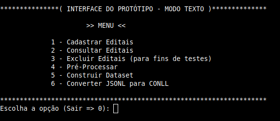

# ren_editais
Repositório para disponibilização do protótipo da ferramenta para executar a tarefa de REN (Reconhecimento de Entidades Nomeadas) em editais de compras. 

Este protótipo está sendo utilizado na dissertação apresentada ao [Programa de Pós-Graduação em Computação Aplicada do Instituto Federal do Espírito Santo (IFES)](https://www.ifes.edu.br/cursos/pos-graduacao/mestrado-em-computacao-aplicada), como requisito parcial para obtenção do título de Mestre em Computação Aplicada.

Aluno: [Messias Gomes da Silva](http://lattes.cnpq.br/4261938952361658)<br>
Orientador: [Prof. Dr. Hilário Tomaz Alves de Oliveira](http://lattes.cnpq.br/8980213630090119)<br>
Repositório do artigo publicado: [*"Combining Word Embeddings for Portuguese Named Entity Recognition"*](https://github.com/messias077/ner_pt)

[Documentação do protótipo](docs/program_documentation/index.html)

---
## Introdução
Este README fornece informações e instruções para quem quiser testar o protótipo e/ou reproduzir os experimentos de REN utilizando o *corpus* (['ren_editais/corpora'](corpora/)) disponibilizado neste repositório. São basicamente duas opções de uso:
* **Testar a geração de um *corpus*.** Basta seguir os passos descritos na seção [1](#1-preparação-do-ambiente) e [2](#2-instruções-de-uso). É importante ressaltar que, executando estes passos, será quase impossível gerar o mesmo arquivo de *corpus* que foi produzido neste trabalho, pois este processo envolve a anotação manual das entidades executada por uma ou mais pessoas, assim sendo, para reproduzir o mesmo corpus, seria necessário a anotação, exatamente, das mesmas entidades que foram anotadas pelo grupo de pessoas que auxiliaram no processo de anotação e geração do *corpus* disponibilizado em ['ren_editais/corpora'](corpora/). Portanto, o intuito das seções 1 e 2 é fornecer uma maneira dos interessados no protótipo poderem testar o processo de geração de um *corpus* de teste, realizando anotações das entidades (através da ferramenta Doccano), exportando e gerando o *corpus* de teste no formato CONLL.

* **Reproduzir os experimentos.** Caso queira somente reproduzir os experimentos de REN realizados neste trabalho, sem testar a geração de um *corpus*, prepare seu ambiente executando os passos descritos na seção [1](#1-preparação-do-ambiente), **EXCETO** a instalação do **MongoDB** (ele não será necessário para a reprodução dos experimentos), e depois vá direto para a seção [3](#3-reproduzir-os-experimentos).

Se você estiver interessado em testar o protótipo e também reproduzir os experimentos, será uma satisfação enorme! Neste caso, siga todos os passos descritos a seguir.

## 1. Preparação do ambiente
Antes de utilizar o protótip, é necessário preparar o sistema do seu computador para executá-lo.

### 1.1 - Pré-requisitos
Instale os programas abaixo:
* **MongoDB.** Instale e deixe o MongoDB em execução (*Nota: Para fins de testes, não há necessidade de criar usuário e senha para acesso ao banco, o protótipo funcionará sem*). Instruções: [Linux](https://www.mongodb.com/docs/manual/administration/install-on-linux/) ou [Windows](https://www.mongodb.com/docs/manual/tutorial/install-mongodb-on-windows).

* **Python.** Instruções: [Linux (Geralmente já vem instalado por padrão)](https://python.org.br/instalacao-linux) ou [Windows](https://www.python.org/downloads/windows).

* **Git.** Instruções: [Linux](https://git-scm.com/download/linux) ou [Windows](https://git-scm.com/download/win).

*Nota: Há possibilidade de instalar o MongoDB via container do [Docker](https://www.docker.com/), porém esta forma de instalação não será abordada nos testes. Caso queira instalar dessa forma, fique à vontade, pois o protótipo suporta e funciona perfeitamente.*

### 1.2 - Organize as coisas
* **Crie uma pasta para organizar os arquivos em um local de sua preferência.**

### 1.3 - Tela preta
* **Comandos.** Todos os comandos daqui em diante serão na famosa tela preta do terminal! Abra um shell Linux ou prompt de comando Windows para executar os próximos passos.

### 1.4 - Ambiente virtual Python (opcional)
*Nota: Apesar de não ser mandatório, a criação de um ambiente virtual ajuda na organização dos projetos e evita conflitos entre bibliotecas de projetos diferentes.*
* **Instale e ative o Venv.** Entre na pasta criada no passo 1.2, instale e ative Venv. Instruções: [Linux e Windows (escolha o sistema na página)](https://packaging.python.org/en/latest/guides/installing-using-pip-and-virtual-environments/#creating-a-virtual-environment).

### 1.5 - Clone o repositório
* **Clone.** De dentro da pasta criada no passo 1.2, clone o repositório com o comando:
```
git clone https://github.com/messias077/ren_editais.git
```

### 1.6 - Dependências do projeto
* **Instale as dependências.** Entre na pasta criada pelo processo de clonagem do repositório...
```
cd ren_editais
```
e rode o comando:
```
pip install -r requirements.txt
```
*Nota: Caso dê algum erro na instalação das dependências, não continue antes de resolver... Pesquisar o erro no Google pode ajudar!*

---
## 2. Instruções de uso

Para utilizar o protótipo e rodar os testes com parâmetros padrão execute os passos abaixo:

### 2.1 - Copiar editais
* **Copie editais de testes.** Copie os editais de testes que estão localizados na pasta ['ren_editais/editais_testes'](editais_testes/) para a pasta de entrada padrão do protótipo que é, 'ren_editais/repo/editais', ou para outra pasta, caso tenha alterado os arquivos de configuração.

### 2.2 - Processar editais
* **Rode o script para processar editais e gerar os arquivos para anotação.** Execute o comando abaixo para converter os editais em texto plano, cadastrar no banco de dados e gerar os arquivos que os anotadores utilizam para importar no Doccano e realizar as anotações.
```
python gerar_dataset_anotacao.py
```
### 2.3 - Anotação das entidades
* **Realizar anotações.** Importe os arquivos gerados no passo 2.2 para dentro da ferramenta Doccano, faça as anotações e exporte os arquivos anotados. Instruções: [Tutorial para instalação do Doccano e anotação das entidades](docs/Tutorial_Doccano.pdf).

### 2.4 - Geração do *corpus* de teste
* **Copie os arquivos anotados.** Copie os arquivos JSONL que foram anotados e exportados pela ferramenta Doccano para a pasta de arquivos anotados padrão do protótipo, que é 'repo/arquivos_anotados', ou para outra pasta, caso tenha alterado os arquivos de configuração.

* **Gere o *corpus* de teste no formato CONLL.** Para converter os arquivos anotados e gerar o *corpus* no formato CONLL rode o comando abaixo:
```
converter_arquivos_anotados.py
```
Pronto! Se tudo aconteceu conforme esperado, nesse ponto você tem um *corpus*, baseado nos editais de testes, que pode ser utilizado como base para realizar as tarefas de REN.

### * (Opcional) Modo interativo

Para realizar a geração do *corpus* de teste é possível também interagir com o protótipo através de uma interface em modo texto.
<br>



Nesta, a escolha da opção **'1 - Cadastrar editais'** e em seguida as opções **'2 - Pré-Processar'** e **'4 - Construir Dataset'** é equivalente à rodar o script *'gerar_dataset_anotacao.py'* (descrito no passo [2.2](#22---processar-editais)), porém fornecendo os parâmetros interativamente.

Já, ao escolher a opção **'5 - Converter JSONL para CONLL'**, após ter realizado a anotação dos arquivo no Doccano, é equivalente à rodar o script *'converter_arquivos_anotados.py'* (descrito no passo [2.4](#24---geração-do-corpus)).

A opção **'3 - Buscar editais (MongoDB)'** pode ser utilizada para pesquisar os editais que tiveram o conteúdo extraido e salvo no banco de dados. Não há script equivalente para esta opção.

FALAR DO MODO INTERATIVO E DA DOCUMENTAÇÃO DAS OPÇOES

---
## 3. Reproduzir os experimentos
Em construção... Será disponibilizado futuramente!