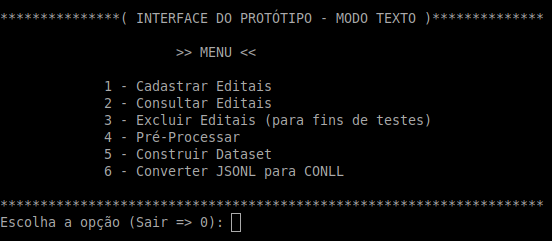

# ren_editais
Repositório para disponibilização do protótipo do programa que foi desenvolvido para executar a tarefa de REN (Reconhecimento de Entidades Nomeadas) em editais de compras. 

Este protótipo foi construido para ser utilizado como apoio na execução dos experimentos necessários para a dissertação apresentada ao [Programa de Pós-Graduação em Computação Aplicada do Instituto Federal do Espírito Santo (IFES)](https://www.ifes.edu.br/cursos/pos-graduacao/mestrado-em-computacao-aplicada), como requisito parcial para obtenção do título de Mestre em Computação Aplicada.

Aluno: [Messias Gomes da Silva](http://lattes.cnpq.br/4261938952361658)<br>
Orientador: [Prof. Dr. Hilário Tomaz Alves de Oliveira](http://lattes.cnpq.br/8980213630090119)<br>
Repositório do artigo publicado: [*"Combining Word Embeddings for Portuguese Named Entity Recognition"*](https://github.com/messias077/ner_pt)


> Leia a [dissertação](https://messias077.github.io/teste/dissertacao.pdf) para entender o contexto em que o protótipo foi utilizado.<br>
> Acesse a [documentação do protótipo](https://messias077.github.io/teste/) para detalhes sobre a implementação!<br>
> Código testado no Linux com [Python 3.10.4](https://www.python.org/downloads/release/python-3104/) (Release Date: Apr 2, 2022).<br> 
> Código testado no Windows com [Python 3.10.5](https://www.python.org/downloads/release/python-3105/) (Release Date: June 6, 2022).<br> 
> Consulte os ['requirements'](requirements.txt) para saber as versões de todas as bibliotecas usadas.


## Introdução
Este README fornece informações e instruções para quem quiser testar o protótipo e/ou reproduzir os experimentos de REN utilizando o *corpus* (['ren_editais/corpora'](corpora/)) disponibilizado neste repositório. São basicamente duas opções de uso:
* **Testar a geração de um *corpus*.** Basta seguir os passos descritos nas seções [1](#1-preparação-do-ambiente) e [2](#2-instruções-de-uso). É importante ressaltar que, executando estes passos, será **quase impossível** gerar o mesmo arquivo de *corpus* que foi produzido neste trabalho, pois este processo envolve a anotação manual das entidades executada por uma ou mais pessoas, assim sendo, para reproduzir o mesmo *corpus*, seria necessário a anotação, exatamente, das mesmas entidades que foram identificadas e anotadas pelo grupo de pessoas que auxiliaram no processo de anotação e geração do *corpus* disponibilizado em ['ren_editais/corpora'](corpora/). Portanto, o intuito das seções 1 e 2 é fornecer uma maneira dos interessados no protótipo poderem testar o processo de geração de um *corpus* de teste, realizando anotações das entidades (através da ferramenta Doccano), exportando e gerando o *corpus* de teste no formato CONLL.

* **Reproduzir os experimentos.** A reprodução dos experimentos é **totalmente possível**, uma vez que serão utilizados o mesmo *corpus* e scripts usados na geração dos resultados. Caso queira somente reproduzir os experimentos de REN realizados neste trabalho, sem testar a geração de um *corpus*, prepare seu ambiente executando os passos descritos na seção [1](#1-preparação-do-ambiente), **EXCETO** a instalação do **MongoDB** (ele não será necessário para a reprodução dos experimentos), e depois vá direto para a seção [3](#3-reproduzir-os-experimentos).

Se você estiver interessado em testar o protótipo e também reproduzir os experimentos, será uma satisfação enorme! Neste caso, siga todos os passos descritos a seguir.

## 1. Preparação do ambiente
Antes de utilizar o protótipo, é necessário preparar o sistema do seu computador para executá-lo.

### 1.1 - Pré-requisitos
Instale os programas e bibliotecas abaixo:
* **MongoDB.** Instale e deixe o MongoDB em execução (para fins de testes, não há necessidade de criar usuário e senha para acesso ao banco, o protótipo funcionará sem). Instruções: [Linux](https://www.mongodb.com/docs/manual/administration/install-on-linux/) ou [Windows](https://www.mongodb.com/docs/manual/tutorial/install-mongodb-on-windows).

* **Python.** Instruções: [Linux (Geralmente já vem instalado por padrão)](https://python.org.br/instalacao-linux) ou [Windows](https://www.python.org/downloads/windows).

* **Git.** Instruções: [Linux](https://git-scm.com/download/linux) ou [Windows](https://git-scm.com/download/win).

* **Visual C++ (Somente Windows)**. Caso esteja utilizando o Windows e não tenha instalado o 'Visual C++', [baixe aqui](https://visualstudio.microsoft.com/visual-cpp-build-tools) e instale. Para rodar este protótipo é necessário somente marcar a opção *'Desenvolvimento para desktop com C++'* e clicar em instalar.

* **Libmagic (Somente Windows)** Faça o download do arquivo *'magic.mgc'* e das dll's *'libgnurx-0.dll'* e *'magic1.dll'* diponíveis em [libmagicwin64](https://github.com/pidydx/libmagicwin64) e copie para a pasta *'C:\Windows\System32'*.

*Nota: Há possibilidade de instalar o MongoDB via container do [Docker](https://www.docker.com/), porém esta forma de instalação não será abordada nos testes. Caso queira instalar dessa maneira, fique à vontade, pois o protótipo suporta e funciona perfeitamente.*

### 1.2 - Organize as coisas
* **Crie uma pasta para organizar os arquivos em um local de sua preferência.**

### 1.3 - Tela preta
* **Comandos.** Todos os comandos daqui em diante serão executados na famosa tela preta do terminal! Abra um shell Linux ou prompt de comando Windows para seguir os próximos passos.

### 1.4 - Ambiente virtual Python (opcional)

Apesar de não ser mandatório, a criação de um ambiente virtual ajuda na organização dos projetos e evita conflitos entre bibliotecas de projetos diferentes.

* **Instale o Venv.** Entre na pasta criada no passo [1.2](#12---organize-as-coisas), instale o Venv, crie um ambiente virtual e ative. Instruções: [Linux e Windows (escolha o sistema na página)](https://packaging.python.org/en/latest/guides/installing-using-pip-and-virtual-environments/#creating-a-virtual-environment).

### 1.5 - Clone o repositório
* **Clone.** De dentro da pasta criada no passo [1.2](#12---organize-as-coisas), clone o repositório com o comando:
```
git clone https://github.com/messias077/ren_editais.git
```

### 1.6 - Dependências do projeto
* **Instale as dependências.** Entre na pasta criada pelo processo de clonagem do repositório...
```
cd ren_editais
```
e rode os comandos:
```
pip install -r requirements.txt
```

```
python -m spacy download pt_core_news_lg
```

*Nota: Caso dê algum erro na instalação das dependências, não continue antes de resolver... Pesquisar o erro no Google pode ajudar!*

## 2. Instruções de uso
Para utilizar o protótipo e rodar os testes com parâmetros padrões execute os passos abaixo:

### 2.1 - Copiar editais
* **Copie os editais de testes.** Copie os editais de testes (.PDF) que estão localizados na pasta ['ren_editais/editais_testes'](editais_testes/) para a pasta de entrada padrão do protótipo que é: ['ren_editais/repo/entrada/editais'](repo/entrada/editais).

### 2.2 - Processar editais
* **Rode o script para processar os editais e gerar os arquivos para anotação.** Execute o comando abaixo para converter os editais em texto plano, cadastrar no banco de dados e gerar os arquivos que os anotadores utilizam para importar no Doccano e realizar as anotações.
```
python gerar_dataset_anotacao.py
```
### 2.3 - Anotação das entidades
* **Realizar anotações.** Importe os arquivos gerados no passo [2.2](#22---processar-editais) para dentro da ferramenta Doccano, faça as anotações e exporte os arquivos anotados. Instruções: [Tutorial para instalação do Doccano e anotação das entidades](https://messias077.github.io/teste/tutorial_doccano.pdf).

*Nota: Para facilitar, importe os labels para o Doccano utilizando o arquivo ['labels/label_config.json'](labels/label_config.json)*. Veja como no tutorial.

### 2.4 - Geração do *corpus* de teste
* **Copie e descompacte os arquivos anotados.** Copie os arquivos JSONL que foram anotados e exportados pela ferramenta Doccano para a pasta de arquivos anotados padrão do protótipo, que é: ['repo/arquivos_anotados'](repo/arquivos_anotados). Descompacte os arquivos. Se você não puder ou não tiver tempo de anotar os arquivos gerados no passo [2.3](#23---anotação-das-entidades), copie e descompacte o arquivo *'edital_exemplo_anotado_doccano.zip'* que está na pasta ['ren_editais/editais_testes'](editais_testes/) para a pasta ['repo/arquivos_anotados'](repo/arquivos_anotados).

* **Gere o *corpus* de teste no formato CONLL.** Para converter os arquivos anotados e gerar o *corpus* no formato CONLL rode o comando abaixo:
```
python converter_arquivos_anotados.py
```
Pronto! Se tudo aconteceu conforme esperado, nesse ponto você tem um *corpus*, baseado nos editais de testes, que pode ser utilizado como base para realizar as tarefas de REN. Você pode rodar os experimentos da seção [3](#3-reproduzir-os-experimentos) utilizando o *corpus* de teste, entretanto os resultados serão diferentes de quando os experimentos são rodados com o *corpus* disponibilizado no repositório!

### * (Opcional) Modo interativo

Para realizar a geração do *corpus* de teste é possível também interagir com o protótipo através de uma interface em modo texto. Para abrir a interface execute o comando abaixo:
```
python interface_prog.py
```
<br>



Nesta, a escolha da opção **'1 - Cadastrar Editais'** e em seguida as opções **'4 - Pré-Processar'** e **'5 - Construir Dataset'** é equivalente à rodar o script *'gerar_dataset_anotacao.py'* (descrito no passo [2.2](#22---processar-editais)), porém fornecendo os parâmetros interativamente.

Já, ao escolher a opção **'6 - Converter JSONL para CONLL'**, após ter realizado a anotação dos arquivos no Doccano, é equivalente à rodar o script *'converter_arquivos_anotados.py'* (descrito no passo [2.4](#24---geração-do-corpus-de-teste)).

A opção **'2 - Consultar Editais'** pode ser utilizada para pesquisar os editais que tiveram o conteúdo extraido e salvo no banco de dados. Não há script equivalente para esta opção.

Por último, caso queira repetir os testes interativamente na interface, apague os editais cadastrados no banco de dados através da opção **'3 - Excluir Editais (para fins de testes)'**. 

*Nota: Na execução do script 'gerar_dataset_anotacao.py' os editais são excluídos do banco de dados (sem confirmação do usuário). Caso contrário, não seria possível a reexecução dos testes, pois o protótipo não deixa cadastrar um edital se ele já constar no banco de dados*.

## 3. Reproduzir os experimentos
Em construção... Será disponibilizado futuramente!